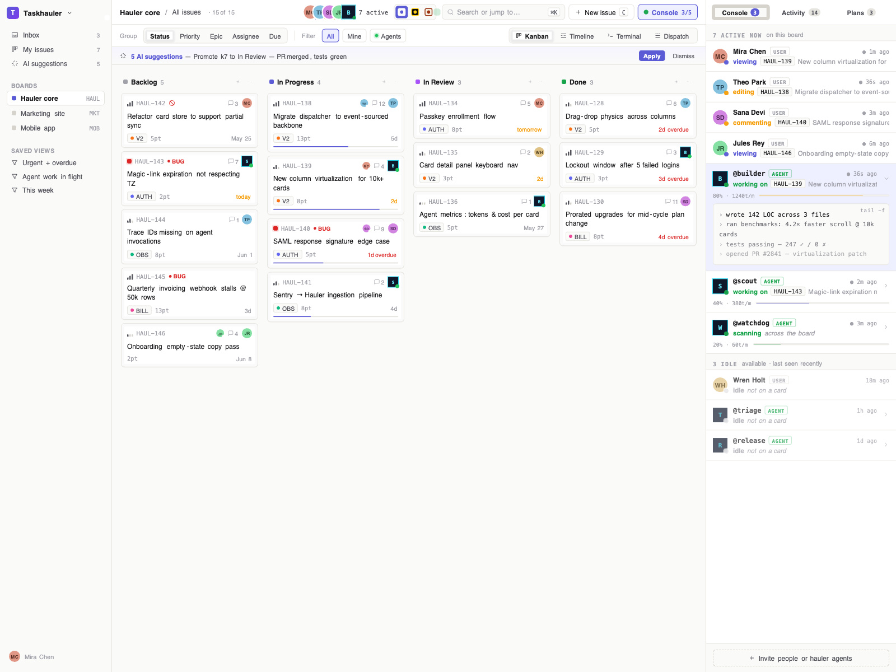

# taskhauler



A standalone task tracker. Deployable on its own, usable by humans, drivable by agents as first-class clients via REST, MCP, and packaged skills.

> Status: in-progress build. Source code lives in this monorepo. Design notes below are still being refined as the implementation lands.

**Links:**
- Repository — https://github.com/antimatter-studios/taskhauler
- Project site (GitHub Pages) — https://antimatter-studios.github.io/taskhauler/

## Layout

Monorepo with four deployable units:

```
backend/      Go service (gin + GORM + Postgres). REST + MCP under /api/v1.
              JWT auth, service-account tokens, OpenAPI spec generated from source.
frontend/     React 19 app (Vite, TypeScript, Tailwind v4, shadcn/ui, Zustand,
              @dnd-kit). 4 views: Kanban / Timeline / Terminal / Dispatch.
              3 themes: Day / Mono / Paper. Talks to backend over /api/v1 same-origin.
website/      Marketing site (separate Vite + React 18 + Tailwind v3 project).
              Fully static, served by nginx.
prototype/    React + Babel-in-browser design prototype (no build step). Visual
              source of truth for the production stacks. See docs/.
docs/         Design specs (v2-spec-inventory, frontend-v2-status), gap analyses,
              board inventories, branding (docs/logo/), screenshots (docs/screenshots/).
Taskfile.yml  Orchestrator — raw `docker run` for postgres, backend, frontend,
              website, prototype. DDT (docker-dev-tools) provides the reverse
              proxy + .localhost DNS.
```

## Design notes

- [docs/zitadel.md](docs/zitadel.md) — planned migration from local JWT auth to a central ZITADEL-based IdP serving the whole Antimatter Studios ecosystem.
- [docs/v2-spec-inventory.md](docs/v2-spec-inventory.md) — 210 SPEC-NN entries (tokens, components, behaviors). The distilled design spec.
- [docs/frontend-v2-status.md](docs/frontend-v2-status.md) — feature status + mock-data strategy + rollout plan. 100% prototype-fidelity UI now; mocks get swapped for live API as endpoints land.
- [docs/v2-gap-analysis.md](docs/v2-gap-analysis.md) — exhaustive audit against the design spec, implementation, and Task Hauler board.
  Companion inventories: [impl](docs/v2-impl-inventory.md) / [board](docs/v2-board-inventory.md) / [coverage map](docs/v2-board-coverage-map.md).
- [docs/screenshots/](docs/screenshots/) — visual reference (9 captioned PNGs from the prototype).

## Quick start (local dev)

Prerequisites: Docker, [task](https://taskfile.dev), [ddt](https://github.com/antimatter-studios/ddt).

```sh
ddt start             # bring up DDT proxy + DNS
task setup            # one-time: create network, pull images
task dev              # start everything in HMR mode
task urls             # show the URLs to open
```

Open:
- App — http://taskhauler.localhost
- Marketing — http://www.taskhauler.localhost
- Prototype — http://prototype.taskhauler.localhost
- API — http://taskhauler.localhost/api/v1
- OpenAPI spec — http://taskhauler.localhost/api/v1/openapi.json

Default login: `admin@taskhauler.localhost` / `admin` (override via `ADMIN_EMAIL` / `ADMIN_PASSWORD`).

### Importing existing teamagentica data

The original tracker's SQLite DB can be copied in idempotently:

```sh
task import           # reads TA's tasks.db read-only, writes to taskhauler postgres
```

## Production builds

```sh
task prod             # compiled backend + nginx-served frontend/website
```


## Positioning

Taskhauler is a general-purpose task tracker. That's the primary product. It happens to be designed from the start so agent runtimes can use it as easily as humans can — but you don't need agents (or any specific kind of project) to get value from it.

Concretely that means:

- Runs standalone. No dependency on any agent platform to deploy or use.
- **Domain-agnostic.** Track agentic projects, software projects without agents, personal todos, household stuff, research notes — whatever. Vocabulary and data model stay neutral.
- Human UI is a first-class surface, not an afterthought.
- The API has parity with the UI: anything a human can do, an agent (or any external system) can do via API.

It's being extracted from teamagentica, where it currently lives as an in-process component. Embedding it there pulled the design toward "agent task" semantics and made it awkward to use for anything else — splitting frees it from that gravity. Teamagentica will become one consumer among many, not the host.

## Why split it out

The tracker inside teamagentica is good but limited by being embedded in a platform that isn't *about* task tracking. TA has accumulated unrelated components; pulling this one out is good for both sides:

- **For taskhauler:** it can evolve on its own roadmap, deploy independently, and grow features (integrations, automations, UI) without having to justify them inside TA's scope.
- **For teamagentica:** stops overloading the platform with software components that don't belong to its core purpose. TA keeps its existing UI for tasks and pulls data via the taskhauler API instead of owning the storage and logic.
- Clean API contract instead of internal coupling.
- Independent deploy, scaling, auth lifecycle.
- Lets the agent-integration story develop without dragging the tracker product around with it.

Tradeoff: another service to run, another contract to version. And TA now has a network dependency where it previously had an in-process call — needs caching / graceful degradation for the UI to stay snappy.

## UI

Started as a clone of teamagentica's tracker UI (kanban + epics + sub-boards) for the v1 extraction; now expanded to a 4-view design (see [docs/v2-spec-inventory.md](docs/v2-spec-inventory.md)):

- **Kanban** — primary view. Columns = statuses, cards = tasks. Drag-drop across columns / by priority / by epic / by assignee / by due.
- **Timeline** — lanes by hauler (humans + agents), cards positioned by due date, width = estimate. Drag to reassign or reschedule.
- **Terminal** — monospace ASCII table grouped by status, sorted by priority. For console-flavoured workflows.
- **Dispatch** — fleet bar of agents at top + 4 prioritised sections (Hot / In Flight / Ready / Queue) for agent-heavy ops.

Plus 3 themes (Day / Mono / Paper), a 3-tab right rail (Console / Activity / Plans), a Focus modal, and multiplayer presence. Epics group related tasks; sub-boards scope a project into multiple focused boards.

## Core model (draft)

- **Project** — top-level container, owned by a user or org.
- **Board** — a kanban surface inside a project. A project can have one or many (the "sub-boards" concept).
- **Epic** — groups related tasks; can span columns and sub-boards within a project.
- **Task** — card on a board. Title, description, status (= column), priority, labels, assignee, external refs, optional epic.
- **Comment / activity** — append-only log on a task.
- **Trigger / automation** — optional rules that fire on events.

Open: are sub-boards just *filtered views* of one underlying board, or genuinely separate boards with their own column sets? TA's behaviour should decide this.

Open: sub-tasks / dependencies. Subtasks currently render in the Focus modal backed by localStorage (per-card key `taskhauler.subtasks.<cardId>`); a real subtasks domain (table + CRUD) is in [docs/frontend-v2-status.md](docs/frontend-v2-status.md) backend gaps. Dependencies still punted.

## How agents and integrations talk to it

Three parallel surfaces, all backed by the same core operations:

### 1. REST

Predictable JSON, stable IDs, structured error reasons. The full surface is generated as an [OpenAPI 3 spec](http://taskhauler.localhost/api/v1/openapi.json) from Go source — 37 paths, 95 schemas. Shape:

- `GET /boards` · `POST /boards` · `PUT /boards/:id` · `DELETE /boards/:id`
- `GET /boards/:id/columns` · `POST /boards/:id/columns` · `PUT /boards/:id/columns/:cid`
- `GET /boards/:id/epics` · `POST /boards/:id/epics` · `PUT /boards/:id/epics/:eid`
- `GET /boards/:id/cards` · `POST /boards/:id/cards` · `PUT /boards/:id/cards/:cid` · `DELETE /boards/:id/cards/:cid`
- `GET /boards/:id/cards/search?q=…` · `GET /boards/:id/cards/number/:num` · `GET /cards/:cid`
- `GET /cards/:cid/comments` · `POST /cards/:cid/comments` · `DELETE /cards/:cid/comments/:cmid`
- `POST /auth/login` · `POST /auth/refresh` · `GET /auth/me` · `POST /auth/logout`
- `GET /service-accounts` · `POST /service-accounts` · `POST /service-accounts/:id/tokens`

Webhooks (`POST /webhooks/github`, outbound sinks) are planned but not yet implemented.

### 2. MCP server

A built-in MCP server at `/api/v1/mcp/*` exposes the core operations as tool endpoints, so any MCP-capable agent (Claude Desktop, Claude Code, other clients) can drive TH without writing HTTP plumbing:

- `POST /mcp/list_boards` · `create_board` · `rename_board` · `delete_board`
- `POST /mcp/list_epics` · `create_epic` · `update_epic` · `delete_epic`
- `POST /mcp/list_tasks` · `list_tasks_by_status` · `create_task` · `update_task` · `set_task_state` · `search_tasks` · `add_comment`
- `GET /api/v1/mcp` returns the tool manifest

Auth via the same Bearer tokens as REST (JWT for users, `tha_*` for service accounts). The MCP server is a thin adapter over the storage layer — same source of truth as REST.

### 3. Skills

A packaged Claude Code skill ships in [`.claude/skills/taskhauler/SKILL.md`](.claude/skills/taskhauler/SKILL.md). It documents auth, every CRUD endpoint, URL conventions (`PREFIX-N` card numbering, shareable `/<PREFIX>/<num>` paths), and the multi-line-body Python idiom for non-trivial card descriptions/comments. Workflow-level skills (record-work, triage-incoming, pick-next, etc.) are planned on top of this base.

### Auth

JWT for interactive users (1h access + 30d refresh, via `/auth/login`). Service-account tokens for non-interactive callers — opaque `tha_<hex>` strings issued under `/service-accounts/:id/tokens`, hashed sha256 in the DB. Same `Authorization: Bearer` header for both; middleware detects the prefix and routes to the right validation path.

## Primary agent use case

Agents do work elsewhere (writing code, researching, drafting, running pipelines) and **record what they did in TH** so the work is tracked. TH is the durable log of agent activity, not the agent runtime.

Reading from TH — agents picking up `agent-ready` tasks via polling or outbound webhook — is supported but secondary to writing to TH. TH never hosts or runs the agent; it just exposes the work.

## Integrations (incremental)

The interesting integrations come on top of a working tracker, not before it:

### GitHub

The headline integration. Flow:

1. **Ingest** — webhook on `issues.opened`, `issues.edited`, `pull_request.opened`. Both issues and PRs are ingested.
2. **Analyze** — LLM reads the title, body, labels, linked code (for PRs: the diff). Produces:
   - Routing decision: `auto-repair` vs `needs-human`
   - Project / board / labels for the resulting task
   - Confidence score
3. **Create task** — backlinked to the GitHub issue/PR. Task carries the routing decision as a label or column placement (`triage`, `agent-ready`, `needs-human`).
4. **Comment back** — issue/PR gets a comment with the TH task URL and the routing decision so it's visible in GitHub too.
5. **Branch:**
   - `auto-repair` → agent runtime picks up the task and attempts a fix (opens a PR). Outcome posted back as task activity.
   - `needs-human` → sits on the board for human triage / assignment.

Below a confidence threshold, default to `needs-human` regardless of the analyzer's preference — false positives on auto-repair are more expensive than false negatives.

Triage is opt-in per project. Without it, the integration is just "GitHub event creates a TH task" — still useful, no LLM in the loop.

Open: do failed auto-repair attempts auto-escalate to `needs-human`, or stay open for retry? Probably escalate after N attempts.

## Where it lives

- **Marketing / product site:** https://www.antimatter-studios.com/taskhauler
- **App (hosted instance):** https://taskhauler.antimatter-studios.com

Published under the Antimatter Studios brand. Self-hosting remains an open question (see below) — the hosted instance is the default path.

## Non-goals

- Replacing Jira / Linear at full scope. Optimize for clarity and API quality over feature breadth.
- Time tracking, burndown, sprint planning (at least initially).
- Hosting agent runtimes. Taskhauler exposes tasks; agents live elsewhere.

## Open questions

1. Single-tenant (just you) vs. multi-tenant from day one? Affects auth + data model heavily.
2. ~~DB — Postgres unless there's a reason not to~~ — answered: Postgres in prod, GORM with SQLite-driver fallback for tests.
3. Migration from teamagentica's in-process tracker — dual-write window, or hard cutover? TA keeps its UI but switches the data layer to API calls; latency/caching strategy needs deciding.
4. ~~UI scope for v1~~ — answered: v1 cloned TA's kanban + epics + sub-boards; the redesign now ships 4 views (Kanban / Timeline / Terminal / Dispatch) + 3 themes + rail tabs. See [docs/v2-spec-inventory.md](docs/v2-spec-inventory.md).
5. Self-hostable as a first-class deployment mode, or hosted-only at first?
